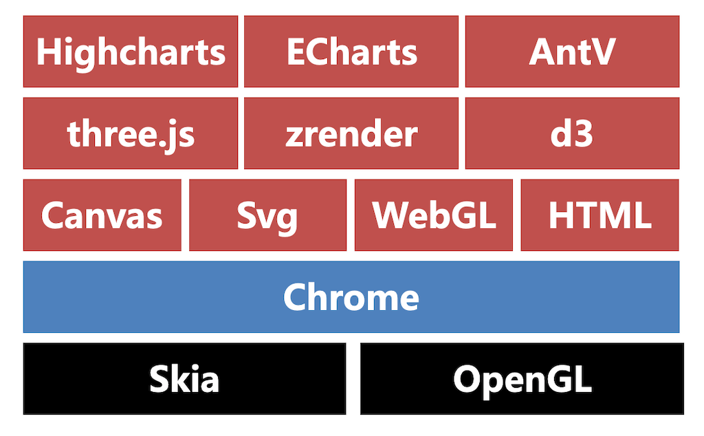

> 数据可视化代码地址：[data-visualization（Github）](https://github.com/sherwinshen/data-visualization)，数据可视化专题系列文章：
>
> - [【专题篇】数据可视化之入门指南](https://www.yuque.com/sherwin-sw/fe/data-visualization)
> - [【专题篇】数据可视化之ECharts篇](https://www.yuque.com/sherwin-sw/fe/data-visualization-echarts)
> - [【专题篇】数据可视化之地图篇](https://www.yuque.com/sherwin-sw/fe/data-visualization-map)
> - [【专题篇】数据可视化之SVG篇](https://www.yuque.com/sherwin-sw/fe/data-visualization-svg)

# 1. 序言

数据可视化，是关于数据视觉表现形式的科学技术研究，其中，这种数据的视觉表现形式被定义为，一种以某种概要形式抽提出来的信息，包括相应信息单位的各种属性和变量（源自百度百科）。当前，在前端领域数据可视化的技术五花八门非常之多，以下为常见的技术选型：



# 2. 技术选型

> 打*内容为重点关注内容，可移步专题篇查看更多内容。

## 2.1 底层支持

Chrome 使用 Skia 作为底层 2D 绘图引擎，向上层开放了 Canvas、SVG、WebGL、HTML 等绘图能力。

### 2.1.1 Canvas

canvas 是 HTML5 的新特性，它允许我们使用 canvas 元素在网页上通过 JavaScript 绘制图像。

#### 2.1.1.1 绘图步骤

1. 编写 canvas HTML 标签（需要指定宽高）
1. 获取 canvas DOM 对象
1. 创建 canvas 对象
1. 设置绘图属性并调用绘图 API

#### 2.1.1.2 基础示例

绘制点、矩形、直线和圆形

```html
<!DOCTYPE html>
<html lang="en">
  <head>
    <meta charset="UTF-8" />
    <meta http-equiv="X-UA-Compatible" content="IE=edge" />
    <meta name="viewport" content="width=device-width, initial-scale=1.0" />
    <title>canvas example</title>
  </head>
  <body>
    <!-- step1. 编写 canvas HTML 标签-->
    <canvas id="canvas" height="800" width="800"></canvas>
    <script>
      // step2. 获取 canvas DOM 对象
      const canvas = document.getElementById("canvas");
      // step3. 创建 canvas 对象
      const ctx = canvas.getContext("2d");
      // step4. 设置绘图属性并调用绘图 API
      /* 正方形绘制 */
      ctx.fillStyle = "red";
      ctx.fillRect(0, 0, 50, 50);
      /* 路径绘制 */
      ctx.beginPath();
      ctx.lineWidth = 1;
      ctx.strokeStyle = "blue";
      ctx.moveTo(100, 100); // 起点
      ctx.lineTo(250, 75); // 可添加多个中间点
      ctx.lineTo(300, 100); // 最后一个即为终点
      ctx.stroke();
      /* 圆形绘制 */
      ctx.beginPath(); // 结束上一段的绘制
      ctx.lineWidth = 10;
      ctx.strokeStyle = "green";
      ctx.fillStyle = "yellow";
      ctx.arc(200, 200, 50, 0, 2 * Math.PI);
      ctx.stroke();
      ctx.fill();
      /* 点绘制 */
      ctx.beginPath(); // 结束上一段的绘制
      ctx.lineWidth = 1;
      ctx.strokeStyle = "red";
      ctx.moveTo(150, 150);
      ctx.lineTo(151, 151); // 也就是一个像素的路径
      ctx.stroke();
    </script>
  </body>
</html>
```

### 2.1.2 SVG*

SVG是一种基于 XML 的图像文件格式，它的英文全称为Scalable Vector Graphics，意思为可缩放的矢量图形。更多内容详见[【专题篇】数据可视化化之SVG篇](https://www.yuque.com/sherwin-sw/fe/data-visualization-svg)。

#### 2.1.2.1 绘图步骤

1. 编写 svg 标签，指定宽高
1. 编写 svg 绘图标签
1. 编写绘图属性和样式

#### 2.1.2.2 基础示例

绘制点、矩形、直线和圆形

```html
<!DOCTYPE html>
<html lang="en">
<head>
  <meta charset="UTF-8">
  <meta http-equiv="X-UA-Compatible" content="IE=edge">
  <meta name="viewport" content="width=device-width, initial-scale=1.0">
  <title>svg-基础案例</title>
</head>
<body>
  <svg height="800" width="800">
    <rect width="50" height="50" style="fill: red" />
    <line x1="100" y1="100" x2="250" y2="75" style="stroke: blue; stroke-width: 1" />
    <line x1="250" y1="75" x2="300" y2="100" style="stroke: blue; stroke-width: 2" />
    <circle cx="200" cy="200" r="50" stroke="green" stroke-width="2" fill="red" style="stroke: green; stroke-width: 1; fill: red " />
  </svg>
</body>
</html>
```

### 2.1.3 WebGL

WebGL（Web Graphics Library）是一种 3D 绘图协议，其可以为 HTML5 Canvas 提供硬件3D加速渲染，Web开发人员可以借助系统显卡在浏览器里更流畅地展示 3D 场景和模型，还能创建复杂的导航和数据视觉化。

#### 2.1.3.1 基础示例

绘制点（WebGL为进阶内容，了解即可）

```html
<!DOCTYPE html>
<html lang="en">
  <head>
    <meta charset="UTF-8" />
    <meta http-equiv="X-UA-Compatible" content="IE=edge" />
    <meta name="viewport" content="width=device-width, initial-scale=1.0" />
    <title>webgl-基础案例</title>
  </head>
  <body>
    <canvas id="canvas" width="200px" height="200px"></canvas>
    <script>
      window.onload = function () {
        //顶点着色器程序
        var VSHADER_SOURCE =
          "void main() {" +
          //设置坐标
          "gl_Position = vec4(0.0, 0.0, 0.0, 1.0); " +
          //设置尺寸
          "gl_PointSize = 10.0; " +
          "} ";

        //片元着色器
        var FSHADER_SOURCE =
          "void main() {" +
          //设置颜色
          "gl_FragColor = vec4(1.0, 0.0, 0.0, 1.0);" +
          "}";
        //获取canvas元素
        var canvas = document.getElementById("canvas");
        //获取绘制二维上下文
        var gl = canvas.getContext("webgl");
        if (!gl) {
          console.log("Failed");
          return;
        }
        //编译着色器
        var vertShader = gl.createShader(gl.VERTEX_SHADER);
        gl.shaderSource(vertShader, VSHADER_SOURCE);
        gl.compileShader(vertShader);

        var fragShader = gl.createShader(gl.FRAGMENT_SHADER);
        gl.shaderSource(fragShader, FSHADER_SOURCE);
        gl.compileShader(fragShader);
        //合并程序
        var shaderProgram = gl.createProgram();
        gl.attachShader(shaderProgram, vertShader);
        gl.attachShader(shaderProgram, fragShader);
        gl.linkProgram(shaderProgram);
        gl.useProgram(shaderProgram);

        //绘制一个点
        gl.drawArrays(gl.POINTS, 0, 1);
      };
    </script>
  </body>
</html>
```

## 2.2 绘图库

### 2.2.1 ECharts*

[ECharts](https://echarts.apache.org/zh/index.html) 是一个基于 JavaScript 的开源可视化图表库（相对较为广泛使用的图表库）。更多内容详见[【专题篇】数据可视化化之ECharts篇](https://www.yuque.com/sherwin-sw/fe/data-visualization-echarts)。

#### 2.2.2.1 绘图步骤

1. 引入 js 库
1. 编写渲染容器 DOM，添加 width 和 height 样式属性
1. 获取渲染 DOM 对象
1. 初始化 ECharts 对象
1. 编写 option 参数
1. 调用 setOption 完成渲染

#### 2.2.2.2 基础示例

柱状图

```html
<!DOCTYPE html>
<html lang="en">
<head>
  <meta charset="UTF-8">
  <meta http-equiv="X-UA-Compatible" content="IE=edge">
  <meta name="viewport" content="width=device-width, initial-scale=1.0">
  <title>ECharts-柱状图</title>
  <script src="https://cdn.jsdelivr.net/npm/echarts@5.3.2/dist/echarts.min.js"></script>
</head>
<body>
  <!-- step1. 编写渲染容器 DOM，添加 width 和 height 样式属性 -->
  <div id="chart" style="width: 800px;height: 400px;"></div>
  <script>
    // step2. 获取渲染 DOM 对象
    const chartDom = document.getElementById('chart')
    // step3. 初始化 ECharts 对象
    const chart = echarts.init(chartDom)
    // step4. 编写 option 参数
    const option = {
        title: {
          text: '快速入门ECharts开发'
        },
        xAxis: {
          data: ['食品', '数码', '服饰', '箱包']
        },
        yAxis: {},
        series: {
          type: 'bar',
          data: [100, 120, 90, 150]
        }
      }
    // step5. 调用 setOption 完成渲染
    chart.setOption(option)
  </script>
</body>
</html>
```

### 2.2.2 AntV*

[AntV](https://antv.gitee.io/zh/) 是蚂蚁金服全新一代数据可视化解决方案，致力于提供一套简单方便、专业可靠、无限可能的数据可视化最佳实践。

#### 2.2.2.1 G2

1. 编写渲染容器 DOM
1. 准备渲染数据
1. 创建 Chart 图表对象，指定图表所在的容器 id、图表的宽高、边距等信息
1. 载入图表数据源
1. 使用图形语法进行图表的绘制
1. 调用 render 完成渲染

```html
<!DOCTYPE html>
<html lang="en">
  <head>
    <meta charset="UTF-8" />
    <meta http-equiv="X-UA-Compatible" content="IE=edge" />
    <meta name="viewport" content="width=device-width, initial-scale=1.0" />
    <title>G2-基础案例</title>
    <script src="https://gw.alipayobjects.com/os/lib/antv/g2/4.1.32/dist/g2.min.js"></script>
  </head>
  <body>
    <!--step1. 编写渲染容器 DOM-->
    <div id="container"></div>
    <script>
      // step2. 准备渲染数据
      const data = [
        { year: "1951 年", sales: 38 },
        { year: "1952 年", sales: 52 },
        { year: "1956 年", sales: 61 },
        { year: "1957 年", sales: 145 },
        { year: "1958 年", sales: 48 },
        { year: "1959 年", sales: 38 },
        { year: "1960 年", sales: 38 },
        { year: "1962 年", sales: 38 },
      ];
      // step3. 创建 Chart 图表对象，指定图表所在的容器 id、图表的宽高、边距等信息
      const chart = new G2.Chart({
        container: "container",
        autoFit: true,
        height: 500,
      });
      // step4. 载入图表数据源
      chart.data(data);
      // step5. 使用图形语法进行图表的绘制
      chart.scale("sales", { nice: true });
      chart.tooltip({ showMarkers: false });
      chart.interaction("active-region");
      chart.interval().position("year*sales");
      // step6. 调用 render 完成渲染
      chart.render();
    </script>
  </body>
</html>
```

#### 2.2.2.2 G6

1. 编写渲染容器 DOM
1. 准备渲染数据
1. 创建 Chart 图表对象，指定图表所在的容器 id、图表的宽高等信息
1. 配置数据源
1. 调用 render 完成渲染

```html
<!DOCTYPE html>
<html lang="en">
  <head>
    <meta charset="UTF-8" />
    <meta http-equiv="X-UA-Compatible" content="IE=edge" />
    <meta name="viewport" content="width=device-width, initial-scale=1.0" />
    <title>G6-基础案例</title>
    <script src="https://gw.alipayobjects.com/os/lib/antv/g6/4.6.4/dist/g6.min.js"></script>
  </head>
  <body>
    <!--step1. 编写渲染容器 DOM-->
    <div id="mountNode"></div>
    <script>
      // step2. 准备渲染数据
      const data = {
        // 点集
        nodes: [
          {
            id: "node1", // String，该节点存在则必须，节点的唯一标识
            x: 100, // Number，可选，节点位置的 x 值
            y: 200, // Number，可选，节点位置的 y 值
          },
          {
            id: "node2", // String，该节点存在则必须，节点的唯一标识
            x: 300, // Number，可选，节点位置的 x 值
            y: 200, // Number，可选，节点位置的 y 值
          },
        ],
        // 边集
        edges: [
          {
            source: "node1", // String，必须，起始点 id
            target: "node2", // String，必须，目标点 id
          },
        ],
      };
      // step3. 创建关系图对象，指定图表所在的容器 id、图表的宽高等信息
      const graph = new G6.Graph({
        container: "mountNode", // String | HTMLElement，必须，在 Step 1 中创建的容器 id 或容器本身
        width: 800, // Number，必须，图的宽度
        height: 500, // Number，必须，图的高度
      });
      // step4. 配置数据源
      graph.data(data);
      // step5. 调用 render 完成渲染
      graph.render();
    </script>
  </body>
</html>
```

#### 2.2.2.3 L7

1. 编写渲染容器 DOM
1. 初始化地图对象 L7.Scene
1. 请求数据
1. 初始化绘图对象并配置相关属性
1. 调用 L7.Scene.addLayer 方法绘图

```html
<!DOCTYPE html>
<html lang="en">
  <head>
    <meta charset="UTF-8" />
    <meta http-equiv="X-UA-Compatible" content="IE=edge" />
    <meta name="viewport" content="width=device-width, initial-scale=1.0" />
    <title>L7-基础案例</title>
    <script src="https://unpkg.com/@antv/l7"></script>
  </head>
  <body>
    <!--step1. 编写渲染容器 DOM-->
    <div id="map"></div>
    <script>
      // step2. 初始化地图对象 L7.Scene
      const scene = new L7.Scene({
        id: "map",
        map: new L7.GaodeMap({
          style: "dark", // 样式URL
          center: [120.19382669582967, 30.258134],
          pitch: 0,
          zoom: 4,
        }),
      });

      // step3. 请求数据
      fetch(
        "https://gw.alipayobjects.com/os/rmsportal/oVTMqfzuuRFKiDwhPSFL.json"
      )
        .then((res) => res.json())
        .then((data) => {
          // step4. 初始化绘图对象并配置相关属性
          const pointLayer = new L7.PointLayer({})
            .source(data.list, {
              parser: {
                type: "json",
                x: "j",
                y: "w",
              },
            })
            .shape("cylinder")
            .size("t", function (level) {
              return [1, 2, level * 2 + 20];
            })
            .color("t", [
              "#094D4A",
              "#146968",
              "#1D7F7E",
              "#289899",
              "#34B6B7",
              "#4AC5AF",
              "#5FD3A6",
              "#7BE39E",
              "#A1EDB8",
              "#CEF8D6",
            ])
            .style({
              opacity: 1.0,
            });
          // step5. 调用 L7.Scene.addLayer 方法绘图
          scene.addLayer(pointLayer);
        });
    </script>
  </body>
</html>
```

### 2.2.3 Highcharts

[Highcharts](https://www.highcharts.com.cn/) 是一个用纯JavaScript编写的一个图表库， 能够很简单便捷的在web网站或是web应用程序添加有交互性的图表，并且免费提供给个人学习、个人网站和非商业用途使用。Highcharts 系列包含 Highcharts JS，Highstock JS，Highmaps JS，High 等内容，均为纯 JavaScript 编写的 HTML5 图表库。

#### 2.2.3.1 Highcharts 

Highcharts 支持的图表类型有直线图、曲线图、区域图、柱状图、饼状图、散状点图、仪表图、气泡图、瀑布流图等多达 20 种图表，其中很多图表可以集成在同一个图形中形成混合图。

#### 2.2.3.2 Highstock 

Highstock 是用纯 JavaScript 编写的股票图表控件，可以开发股票走势或大数据量的时间轴图表。它包含多个高级导航组件：预设置数据时间范围，日期选择器、滚动条、平移、缩放功能。

#### 2.2.3.3 Highmaps 

Highmaps 是一款基于 HTML5 的优秀地图组件。Highmaps 继承了 Highcharts 简单易用的特性，利用它可以方便快捷的创建用于展现销售、选举结果等其他与地理位置关系密切的交互性地图图表。

### 2.2.4 three.js

[Three.js](https://threejs.org) 是一个基于 WebGL 的 Javascript 3D 图形库。

```html
<!DOCTYPE html>
<html lang="en">
  <head>
    <meta charset="UTF-8" />
    <meta http-equiv="X-UA-Compatible" content="IE=edge" />
    <meta name="viewport" content="width=device-width, initial-scale=1.0" />
    <title>threejs-旋转正方体</title>
    <script src="https://cdn.jsdelivr.net/npm/three@0.116.1/build/three.js"></script>
  </head>
  <body>
    <script>
      var camera, scene, renderer;
      var geometry, material, mesh;

      init();
      animate();

      function init() {
        camera = new THREE.PerspectiveCamera(
          70,
          window.innerWidth / window.innerHeight,
          0.01,
          10
        );
        camera.position.z = 1;
        scene = new THREE.Scene();
        geometry = new THREE.BoxGeometry(0.2, 0.2, 0.2);
        material = new THREE.MeshNormalMaterial();
        mesh = new THREE.Mesh(geometry, material);
        scene.add(mesh);
        renderer = new THREE.WebGLRenderer({ antialias: true });
        renderer.setSize(window.innerWidth, window.innerHeight);
        document.body.appendChild(renderer.domElement);
      }

      function animate() {
        requestAnimationFrame(animate);
        mesh.rotation.x += 0.01;
        mesh.rotation.y += 0.02;
        renderer.render(scene, camera);
      }
    </script>
  </body>
</html>
```

### 2.2.5 D3.js

[D3](https://d3js.org/)（Data-Driven Documents） 是一个 Javascript 图形库，基于 Canvas、Svg 和 HTML。

```html
<!DOCTYPE html>
<html lang="en">
  <head>
    <meta charset="UTF-8" />
    <meta http-equiv="X-UA-Compatible" content="IE=edge" />
    <meta name="viewport" content="width=device-width, initial-scale=1.0" />
    <title>d3-数据绑定</title>
    <script src="https://d3js.org/d3.v7.min.js"></script>
  </head>
  <body>
    <p>Vue</p>
    <p>React</p>
    <p>Angular</p>
    <button id="datum">datum</button>
    <button id="data">data</button>
    <script>
      const body = d3.select("body"); // 这不是dom，这是d3相关的对象
      const p = body.selectAll("p");
      const doDatum = () => {
        const str = "Framework";
        p.datum(str);
        p.text((d, i) => {
          return `${d}-${i}`;
        });
      };
      const doData = () => {
        const dataset = ["vue", "react", "angular"];
        p.data(dataset).text((d, i) => {
          return `${d}-${i}`;
        });
      };
      document.getElementById("datum").addEventListener("click", (e) => {
        doDatum();
      });
      document.getElementById("data").addEventListener("click", (e) => {
        doData();
      });
    </script>
  </body>
</html>
```

# 3. 扩展内容

## 3.1 地图组件

简单来说地图组件就是底图+可视化图层（点线面等），更多内容详见[【专题篇】数据可视化化之地图篇](https://www.yuque.com/sherwin-sw/fe/data-visualization-map)，其主要介绍了百度地图和高德地图的基础使用。

------

如果发现本项目有错误，欢迎提交 issues 指正，也可联系邮箱 [EnvisionShen@gmail.com](mailto:EnvisionShen@gmail.com)。

